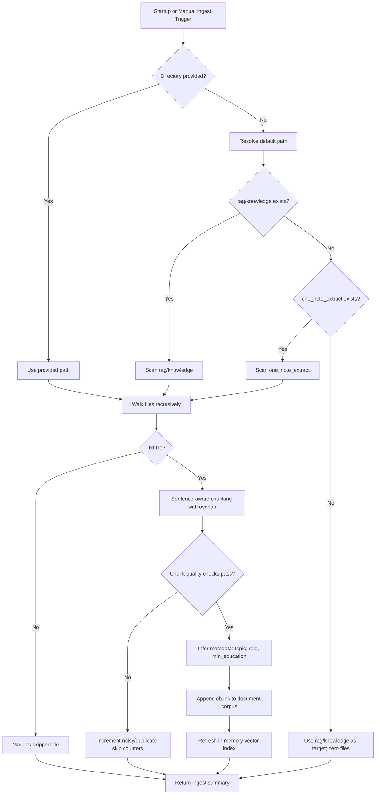

# RAG Ingestion Operations Guide

## Purpose

This guide documents how ingestion works, how to run it safely, and how to verify quality.

The ingestion pipeline feeds document chunks into the in-memory retrieval index used by chat and RAG search endpoints.

## Ingestion Sources

RAG retrieval uses two sources:

1. Built-in base corpus from static role definitions and curated guidance.
2. Ingested document corpus from text files on disk.

The active retrieval corpus is the union of both sources.

## Default Ingestion Path Resolution

When no directory is provided, ingestion checks these folders in order:

1. rag/knowledge/
2. one_note_extract/

If both are missing, the default target is rag/knowledge/ and ingestion returns with no ingested files.

## Startup Auto-Ingest

If RAG is enabled, backend startup attempts automatic ingestion once.

- Trigger condition: RAG_ENABLED=true
- Behavior on failure: startup continues, failure is logged
- Result: document chunks are loaded, vector index is refreshed

This keeps local and demo runs usable even if knowledge files are temporarily unavailable.

## Visual Flow

Interpretation notes:

1. Any manual ingest call refreshes the active index immediately.
2. Startup auto-ingest follows the same path resolution and chunk filtering.
3. Skipped counters are expected and useful for corpus quality tuning.

### Common Failure Patterns (Fast Triage)

| Symptom | Likely Cause | First Check | Fast Fix |
|---|---|---|---|
| document_chunks remains 0 | Folder missing or no valid text chunks | GET /api/v1/rag/status and check ingested_files, skipped counters | Run POST /api/v1/rag/ingest with explicit directory_path and verify .txt files |
| Many skipped_noisy_chunks | Text too short or noisy | Inspect source text for symbols, OCR noise, very short lines | Clean files and merge fragmented notes into full sentences |
| Many skipped_duplicate_chunks | Repeated content across files | Compare similar files and sections | Remove duplicates or keep one canonical version |
| Search returns empty for clear query | Over-restrictive metadata filters or weak document phrasing | Retry GET /api/v1/rag/search with simpler query and no filters | Improve file naming/content keywords; use evaluate endpoint to tune corpus |
| Startup did not ingest | RAG disabled or default paths absent | Check RAG_ENABLED and folder existence | Enable RAG and run POST /api/v1/rag/ingest/default manually |

## Manual Ingestion Endpoints

Use these endpoints when you need explicit control.

### Ingest default path

POST /api/v1/rag/ingest/default

Example:

curl -X POST http://localhost:8000/api/v1/rag/ingest/default

### Ingest a custom directory

POST /api/v1/rag/ingest

Body:

{
  "directory_path": "E:/documents/knowledge"
}

Example:

curl -X POST http://localhost:8000/api/v1/rag/ingest -H "Content-Type: application/json" -d "{\"directory_path\":\"E:/documents/knowledge\"}"

## Status and Verification

Use status endpoint after startup or manual ingestion:

GET /api/v1/rag/status

Important fields:

- enabled: RAG runtime switch
- base_chunks: count from built-in corpus
- document_chunks: count from ingested files
- total_chunks: base + document chunks
- last_ingested_at: UTC timestamp of latest ingest
- ingested_files: processed text files
- skipped_noisy_chunks: filtered low-quality chunks
- skipped_duplicate_chunks: filtered near-duplicate chunks

Quick check sequence:

1. POST ingest endpoint.
2. GET status endpoint.
3. GET /api/v1/rag/search?query=sample+query
4. POST /api/v1/rag/evaluate for query-quality metrics.

## Chunking and Metadata Inference

Each text file is split into sentence-aware overlapping chunks.

- chunk_size: approximately 700 chars
- overlap: approximately 120 chars
- coherence: sentence boundary aware

Each chunk gets metadata used by retrieval filters and reranking:

- topic: inferred from content (interview, learning, networking, job_search, document)
- role: inferred from file name aliases when possible
- min_education: inferred from terms like bachelor, master, phd
- file_name, chunk_index

## Quality Filters During Ingestion

Chunk-level filtering removes weak inputs before indexing:

- Minimum normalized length threshold
- Alphanumeric cleanliness ratio threshold
- Near-duplicate fingerprint check

Effects are surfaced in response and status counters.

## Source File Best Practices

To maximize retrieval quality:

1. Use UTF-8 plain text files with .txt extension.
2. Keep one topic per file whenever possible.
3. Include role and specialization terms in both title and body, not only filename.
4. Write complete sentences rather than keyword lists.
5. Avoid very short, noisy, or symbol-heavy text blocks.

## Precision-First Corpus Design (No Hardcoded Role Logic)

When retrieval answers are too generic (for example, "interview prep" but not specific to data science or automation testing), the root cause is usually corpus structure, not model quality.

Use a coverage matrix so each intent is represented per role and specialization.

Recommended matrix dimensions:

- Intent: interview_prep, learning_path, job_matching, networking, recommendation
- Role: data scientist, data analyst, ml engineer, backend developer, qa automation engineer, etc.
- Specialization: automation testing, api testing, ml system design, experiment design, etc.
- Seniority: fresher, 1-3 years, 3-5 years

For each high-priority cell in the matrix, maintain at least one focused document.

Example cells:

- interview_prep x data scientist x fresher
- interview_prep x qa automation engineer x automation testing
- learning_path x data scientist x ml fundamentals

This removes dependence on brittle keyword aliases in code.

## Document Metadata Contract

Add explicit metadata at the top of each txt document so retrieval can use structured signals.

Preferred header block (first lines in the file):

Title: Data Science Interview Preparation
Intent: interview_prep
Role: data scientist
Specialization: ml, statistics, sql
Seniority: fresher
Tags: case-study, feature-engineering, hypothesis-testing

Then include detailed content below this header.

Why this helps:

- Retrieval can match intent and role from text itself.
- The same strategy works for any new role (for example qa automation engineer) without code edits.
- Evaluation is easier because expected terms and sources are explicit.

## Authoring Pattern for Specificity

For every interview-oriented document, keep this section order:

1. Role-specific round types
2. Role-specific question bank
3. Evaluation rubric
4. 30/60/90 day preparation plan
5. Common mistakes for that exact role

Example specificity contrast:

- Weak: "Practice DSA, communication, and confidence."
- Strong (data scientist): "Practice feature leakage detection, offline metric selection, experiment design, and communicating precision/recall tradeoffs."
- Strong (qa automation): "Practice test pyramid tradeoffs, flaky-test debugging, Playwright/Selenium synchronization issues, API contract validation, and CI failure triage."

## Evaluation Manifest Workflow

Maintain an evaluation manifest that represents real user queries and expected role specificity.

Suggested file location:

- rag/knowledge/eval_manifest.json

Starter manifest:

- `rag/knowledge/eval_manifest.json` now contains an expanded role matrix (engineering + non-engineering, trending + stable roles).
- The active workflow keeps representative role-intent cases enabled and quality-gated.
- Add new roles by appending corpus files plus at least one enabled manifest case per role cluster.

Recommended manifest fields:

- id: stable identifier for CI tracking
- enabled: whether to enforce this case now
- query: user-like prompt
- intent: interview_prep, learning_path, etc.
- target_role: normalized role name
- expected_terms: terms expected in retrieved evidence
- expected_source_contains: expected source filename fragments
- notes: maintenance context

Example entry format:

{
  "query": "how i can prepare for data science interview",
  "intent": "interview_prep",
  "target_role": "data scientist",
  "expected_terms": ["feature engineering", "statistics", "experimentation"],
  "expected_source_contains": ["data_science", "interview"]
}

{
  "query": "how to prepare for automation testing interview",
  "intent": "interview_prep",
  "target_role": "qa automation engineer",
  "expected_terms": ["test pyramid", "api testing", "flaky tests", "ci"],
  "expected_source_contains": ["automation_testing", "interview"]
}

Run each manifest case through POST /api/v1/rag/evaluate and track:

- term_coverage
- source_recall_at_k
- retrieved_count

Set quality gates (example):

- term_coverage >= 0.60
- source_recall_at_k >= 0.70

If a case fails, fix corpus content or metadata first, then tune retrieval.

Rollout strategy:

1. Keep only implementation-ready cases enabled.
2. Add or tune corpus documents before enabling new role cases.
3. Treat any enabled-case failure as ingestion quality regression.

### Run Manifest Checks Locally

From `backend/`:

1. Script summary run:

  python scripts/run_rag_eval_manifest.py

2. Optional top-k override:

  python scripts/run_rag_eval_manifest.py --top-k 5

Exit codes:

- 0: all enabled cases passed
- 1: one or more enabled cases failed quality gates
- 2: manifest path not found

### Optional Pytest Gate

Schema validation test always runs:

- tests/test_rag_manifest.py::test_rag_eval_manifest_has_valid_shape

Quality-gate enforcement test is opt-in to avoid noisy CI while corpus evolves:

1. Set environment variable:

  RAG_MANIFEST_ENFORCE=1

2. Run:

  pytest tests/test_rag_manifest.py -q

### Generate Markdown Trend Report

From `backend/`:

1. Generate latest markdown report and append run history:

  python scripts/generate_rag_eval_report.py

2. Optional custom paths:

  python scripts/generate_rag_eval_report.py --report ../docs/rag-eval-report.md --history ../logs/rag_eval_history.jsonl

Outputs:

- Report: `docs/rag-eval-report.md`
- History: `logs/rag_eval_history.jsonl`

The command exits with code 1 when any enabled case fails quality gates.

### CI Automation

GitHub Actions workflow `.github/workflows/ci-cd.yml` enforces the manifest gates on push and pull request:

1. Install backend dependencies.
2. Validate manifest schema.
3. Enforce enabled-case quality gates with `RAG_MANIFEST_ENFORCE=1`.
4. Generate CI report artifacts:
  - `docs/rag-eval-report-ci.md`
  - `logs/rag_eval_history_ci.jsonl`

This keeps retrieval quality regressions visible before merge.

## Ingestion Change Checklist

Before merging any knowledge update:

1. Ingest new files with POST /api/v1/rag/ingest.
2. Verify counts in GET /api/v1/rag/status.
3. Run eval manifest cases via POST /api/v1/rag/evaluate.
4. Compare telemetry trends after change:
   - GET /api/v1/rag/telemetry
   - GET /api/v1/rag/telemetry/trends/combined
5. Confirm no regression in role-specific queries (data science, automation testing, etc.).

## Troubleshooting

### document_chunks is 0 after ingest

Checks:

1. Confirm target directory exists.
2. Confirm files are .txt.
3. Confirm files contain enough clean text for chunk filters.
4. Call GET /api/v1/rag/status and inspect skipped counters.

### Ingestion succeeds but retrieval is weak

Checks:

1. Run POST /api/v1/rag/evaluate with expected terms/sources.
2. Use intent and target_role fields during evaluation/search.
3. Improve file naming and content structure for stronger metadata.
4. Increase candidate pool size if needed.

### Startup did not ingest documents

Checks:

1. Confirm RAG_ENABLED=true.
2. Confirm rag/knowledge or one_note_extract exists.
3. Manually call POST /api/v1/rag/ingest/default.

## Telemetry Endpoints for Ingestion Impact

After ingestion changes, these endpoints help assess retrieval behavior over recent chat turns:

- GET /api/v1/rag/telemetry
- GET /api/v1/rag/telemetry/trends
- GET /api/v1/rag/telemetry/trends/series
- GET /api/v1/rag/telemetry/trends/combined

Use trends and combined views to compare retrieval_ms, retrieved_count_avg, and non_empty_retrieval_rate after corpus updates.